# Building The Dancing Dog Pricing Structure and Product Selection

###  A Classification Problem

This repository contains the documentation of the creation of the financial portion of a business plan of The Dancing Dog, a craft beer bar with quick serve food which was to be developed in Seattle, Washington.  

The creation of the business plan originated with a feasibility study and forecast creation to see if the efforts would be warranted.  As there was no access to wholesale pricing, the business case was built upon webscraped retail data on December 9, 2013.  By webscraping the webpages of a liquor retailer with a similar demographic as targeted by the owners of The Dancing Dog, the retail pricing structure (without SLT) was binned into the four price categories of Well, Call, Premium, and Super Premium.  The products within these four price categories were then compared to a venue of similar demographics which had their bar selection and pricing online.  Taxes, credit card charges, etc. were later included in the business model, however, for the purposes of forecasting taxes were not included.

###Process 

The result of the web-scraped analysis crossed 11,692 products across 12 liquor-related groups (*Liquerus/Cordials, Tequila, Beer, Cider, Eau de vies, brandies, and other spirits, Gin, Rum, Scotch, Vermouth, Voda, Whiskey, Wine*) for the four price categories of: "Well," "Call", "Premium", and "Super-Premium":
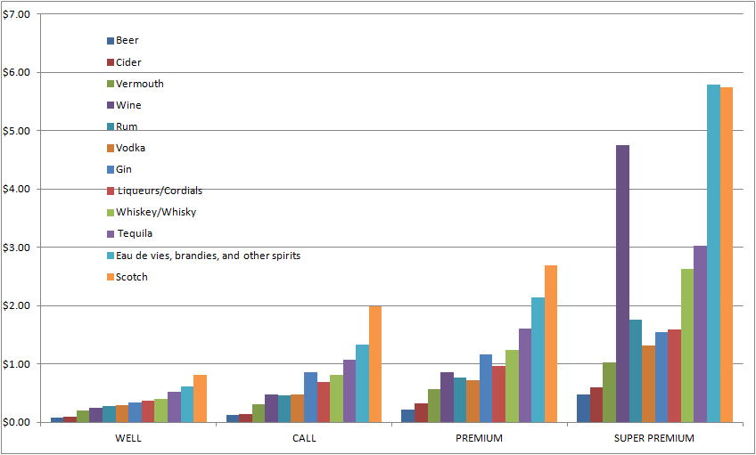

The tool used for the webscrape, cleaning, and analysis used was Excel 2007.  Once the data was scraped and tidied, then the process of getting to the price per ounce (PPOz) began.  

### Analytic Results
The process of getting to the per unit cost, **PPOz**, began when all the volumes were converted to ounces.  This includes quantities like "pony keg", "8pk-16oz Cans", "750 mL", etc.  Duplicate products within the same brand (**Brand-Product**) which had several sizes and thus several price points had the highest prices removed as it was assumed that The Dog would only be selecting based upon best pricing for the same Brand-Product.  Eventually 33 additional records were "tossed" because their price point would exceed The Dancing Dog brand and would thus create an outlier.  

Once the conversions were done and the duplicate Brand-Products removed, a **Retail Cost per oz** was calculated by dividing the ounces in the Brand-Product volume by the Retail cost (which did NOT have the Spirits Tax).  Rounding was to two points after the decimal.  This retail cost per ounce was then "binned" in prepration for creating a histogram. 

The logic behind the binning exercise was multi-fold.  First, all calculations were done on a roundup (Ceiling function in Excel) to the nearest nickel (two points after the decimal).  The next logic step eliminated quantities where the price per ounce exceeded $50.00 because this cost would be considered an outlier for The Dancing Dog brand.  After that, if the Retail Cost per ounce was greater than $3.00, then the rounding down was to the nearest dollar (zero points after the decimal), otherwise the rounding was kept at the nickel stage (two points after the decimal).  This was done to reduce the quantity of variations on a price per ounce basis.  There would be few cases within The Dog brand where a greater than $3.00 per ounce price was going to be used. The final step in creating the "bin" was to combine the liquor type from the 12 categories.  

The logic described above for the binning exercise was created only after multiple exploratory analyses were done.  The decision to use variable bin-widths is outlined in this Wikipedia article:
["Using wider bins where the density is low reduces noise due to sampling randomness; using narrower bins where the density is high (so the signal drowns the noise) gives greater precision to the density estimation. Thus varying the bin-width within a histogram can be beneficial."](https://en.wikipedia.org/wiki/Histogram).  Once that was decided the frequencies and the Frequency as a % of total were calculated.  Once the Frequency as a % of the Total was calculated, then the final logical steps of declaring the price point as "Well" (<=25%), "Call" (>25% AND <= 50%), "Premium" (>50% AND <=75%) or "Super Premium" (> 75%) could be implemented.

The full table of distributions can be found here:
[frequency of the distributions of the 12 liquor types](figure/frequency_of_distributions.png)

The results of this classification were then returned to the Brand-Product in form of a new designator, "Price Point" and the Brand-Product was then classified as either Well, Call, Premium, or Super Premium.

More importantly though, there was a "Price Point Cheat Sheet" with which the owners of The Dancing Dog could walk around with and review retail pricing with.   This was an important tool for a brand focused on craft and locally-sourced products.  This allowed the owners to walk into a brewery or a distillery, review a menu or a price list, do some quick math to come out with a price per ounce and then place that price point against the sheet.  This would give them the means of seeing if they could position a brand, such as Bombay Sapphire Gin, which is commonly charged at a Premium level when its cost is actually at the Call level.  

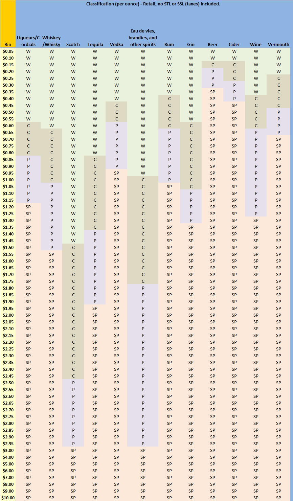

## Building the Forecast

#### Developing the Financial Basics:
[Once the products had been categorized](figure/PricePointExample.png), the next step in developing the financials for the business plan was to see how many units needed to be sold of what type of liquor over a period of time.  The plan had a 7 year ROI window, but the Sales Expense Proforma required only a five year window.  Capital Costs were captured and a Twelve-Month Cash Flow were used for planning the capital expenditures and expenses.

One of the most useful sources of information in developing this analysis came from the website [RestaurantOwner.com](http://www.restaurantowner.com/).  While this exceptional site did not have forecasts and analytics, it had basic Excel templates for the business plan financials as well as a trove of information for ["Rules of Thumb"](http://www.restaurantowner.com/members/Restaurant-Rules-of-Thumb-Industry-Averages-Standards.cfm?sd=71) values for **Investment**, such as Sales to Investment = Annual Sales /Startup Cost; **Profitability**:Sales per square foot;  **Percentage of Cost Rules of Thumb**  Their "At a Glance" was used to evaluate various business "opportunities" offered to the owners by brokers and landlords.

These "Rules of Thumb" became "the rules" for limiting unknowns within the **Goods Basis** with an additional 10% added on. The Goods Basis included rent, NNN, utilities, wages + benefits, the loan, etc.  

#### Average Cost per Serving Size
The 12 types of liquor were then reduced to 6 categories:  beer, cider, whisky, scotch, tequila, and "other".  An **average cost per serving size** was then determined.  To get to this number, first "average serving sizes" had to be determined.  

>The Dancing Dog is a Seattle version of the American Craft movement in drinking establishments.  As a venue, it will highlight craft beers and ciders along with Northwest glassed wines and locally made craft liquors along with a few premium favorites.

The brand statement limited out things like crazy cocktails.  Sodas were not included.  Beer prices were set around keg prices and a 16oz pour.  Liquor was originally based around a 1.5 oz shot. The four classes ("Well", "Call", "Premium", "Super Premium") had the values returned to the original 11,692 products and a key was created with a concatenation of the Brand-Product-Class.  

The next step was to compare the Retail pricing against what was found in actual bars around the Seattle area.  This was done via a combination of webscraping and menu pulling.  A limited product list of comparable products was then sub-selected from the original 11K units.  A new price per ounce was calculated and then that new price per ounce was calculated against a serving size for a new price per serving.

Appropriate sales tax and SLT (SST + SLT for liquor) was then removed plus an X-factor per pour for credit card processing.  This created a [**profit per serving**](figure/ProfitPerServing.png) for the drinks alone.  This profit is what was going to be mashed against the Goods Basis for the expected profitability of The Dancing Dog.  This profitability is considered conservative because the baseline cost of the drinks is based upon retail, not wholesale pricing.  

This profit per serving was then assembled into a Distribution Table.  The Distribution table contained input fields whereby the owner could change the % distribution of Liquors across all the offerings, and the % of each category broken into a class:

The owners would then be able to see the impacts and changes to their profitability based upon how much of which category they sold:

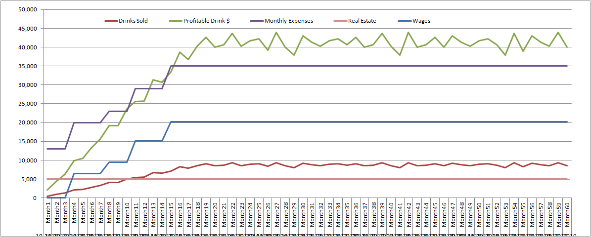

versus:
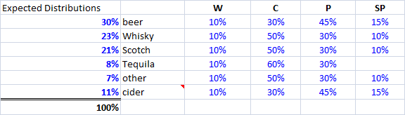
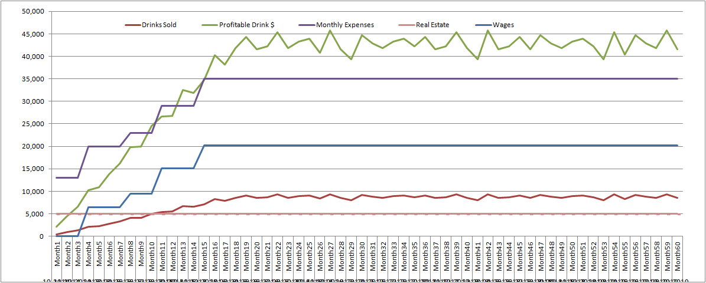

#### Hours of Operation
The other part of the forecast was based upon the maximum number of people the bar could have based upon size and the number of bathrooms, i.e., what the Max Occupancy of the space would be.  With that maximum number minus employees input, a table with the expected % of drinks sold per hour based upon that number was made.  Again, the owners could manipulate the number of days they were open and the % of total capacity that drinks would be sold.  So while the above charts were based upon Tuesday closed data:

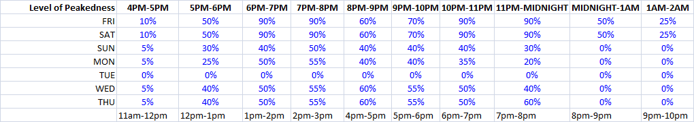

if they opened on Tuesdays with the same distribution as expected on Mondays, they could potentially see:

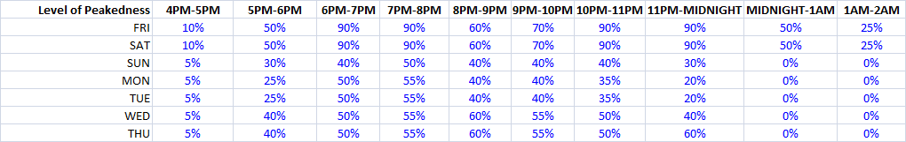
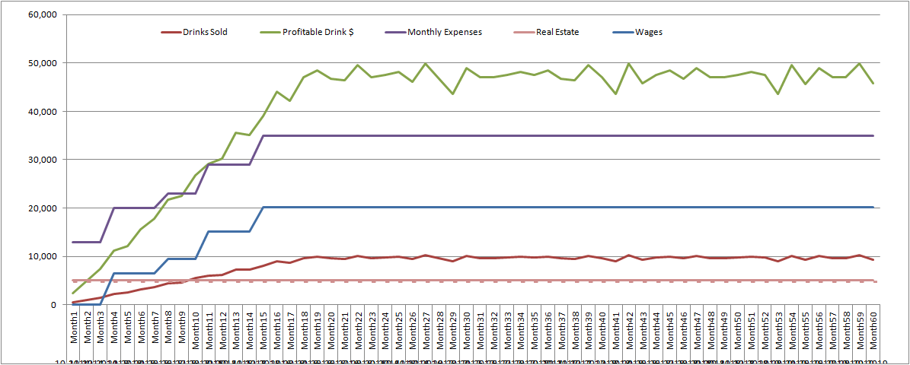

#### Rates of Growth
The final points to the forecast were generating the expected rates of growth, accommodating seasonality, and adding additional variances to the expected monthly maximums.  Additional webscraping was done to create the growth rates.  So the data from the [Washington Beer & Wine Distributors Association](http://www.wbwwa.com/beerwinesales.htm) was pulled, tidied, and charted.  Trend lines were applied.  Beer growth showed a linear trend, but cider required a polynomial trend applied to it.

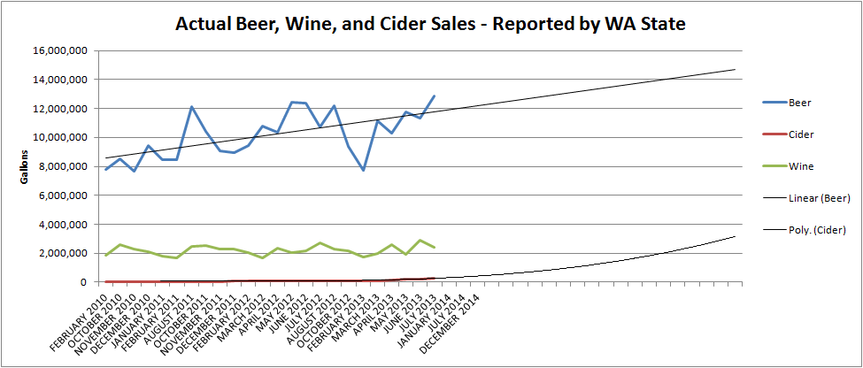
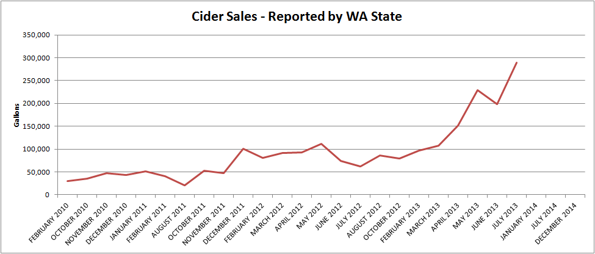
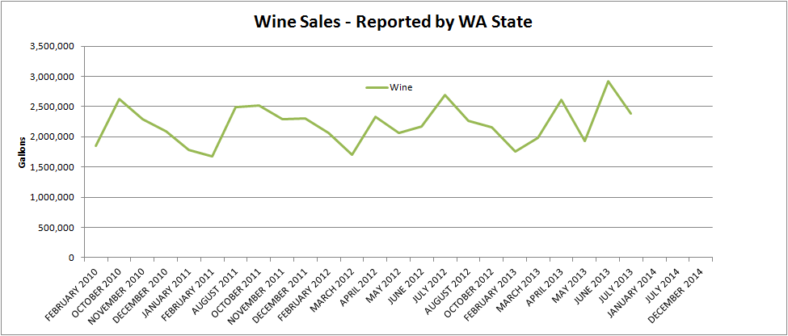

The lack of growth in wine sales was a primary reason why wine was not given a bigger portion of the sales projections.  Efforts were not made to explore more than a few samples of locally produced, organic wines while cider's growth drove its introduction onto the menu.

#### The Final 5-Year Forecast
The final 60 month forecast allowed for a great deal of flexibility in planning.  It did not follow the traditional "Restaurant" model of forecasting, but one derived from the telecommunications industry.  This allowed for greater flexibility in product selection, pricing choice, as well as a better understanding of the size required to support the income projections.  While [RestaurantOwner.com](http://www.restaurantowner.com/) did have a sales projection worksheet, it was based upon traditional table turns.  A snapshot is not shown here because of copyright issues.  

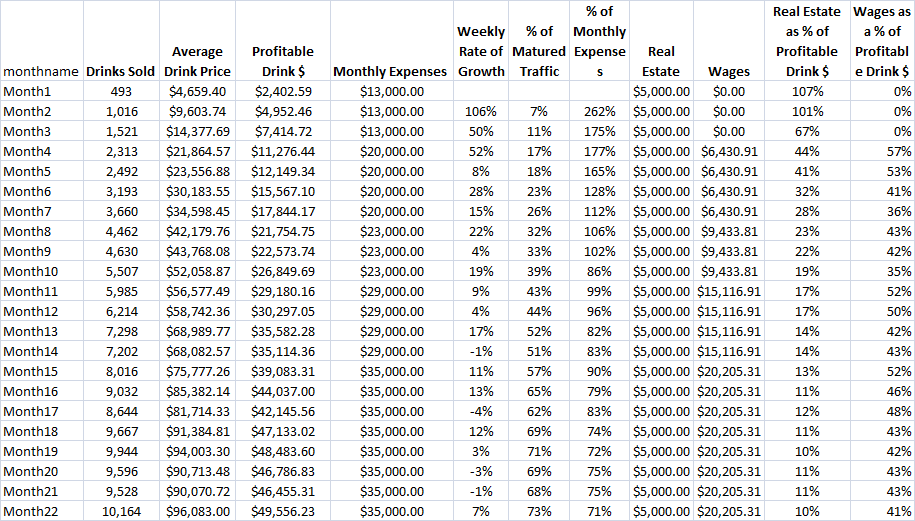

However, their sales projection worksheet did bring up the factor of food which was found to have a significant impact on profitability.  A new iteration of projections began.  The final product (minus financials) is located [here.](Business Plan - no financials.pdf)

